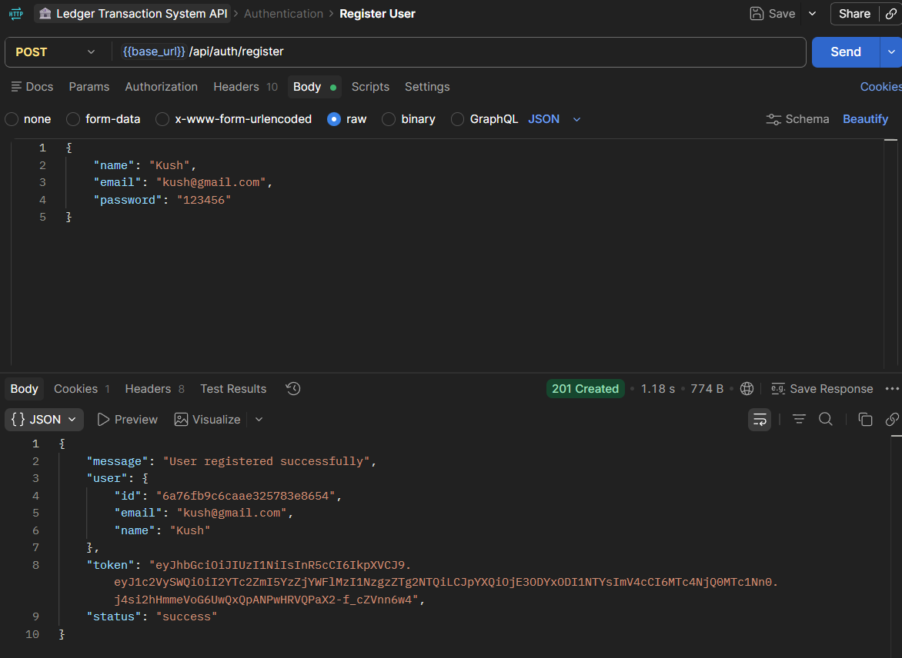
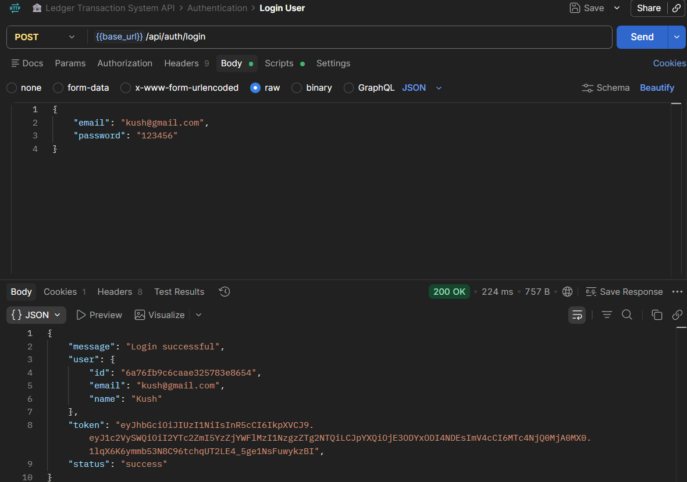
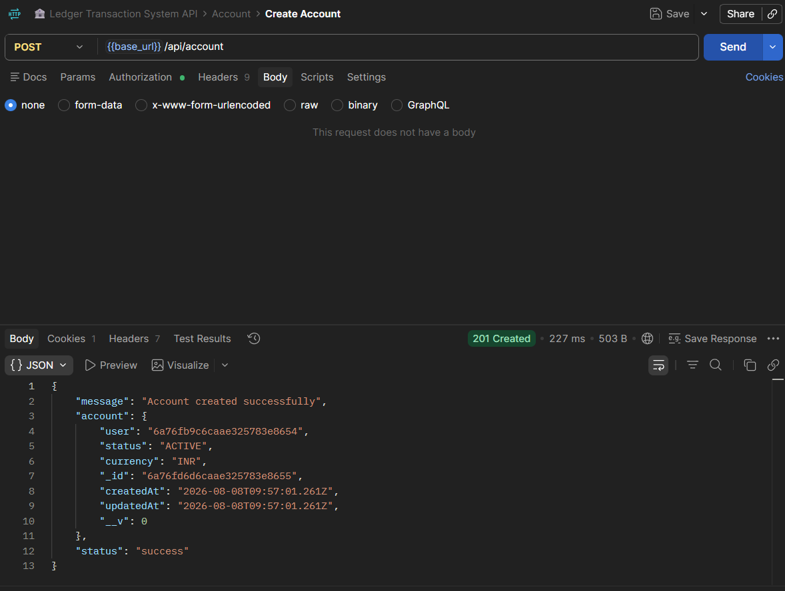
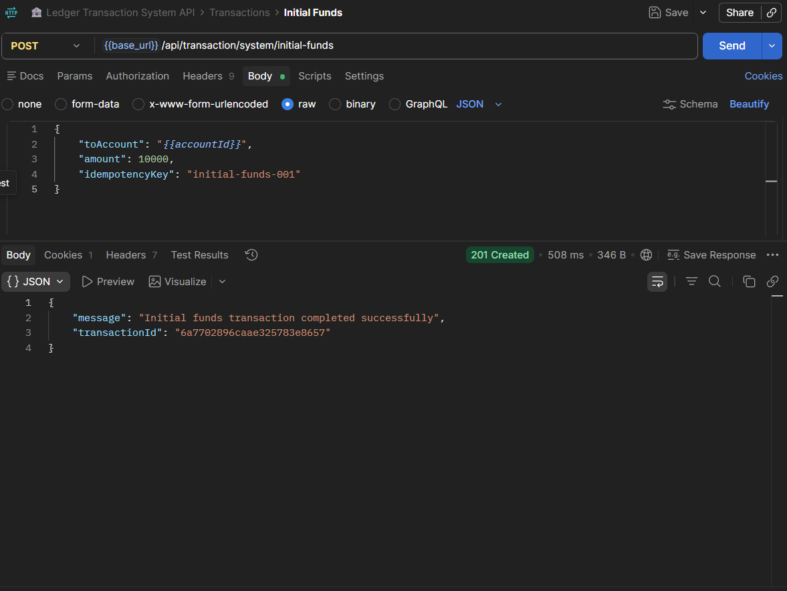
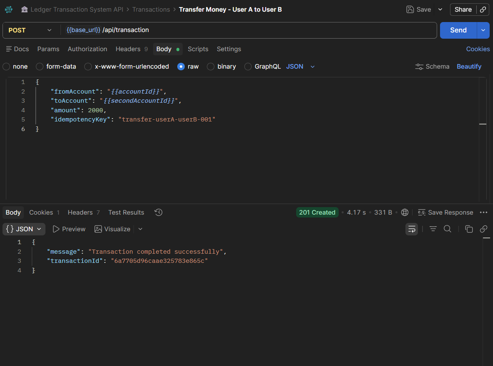
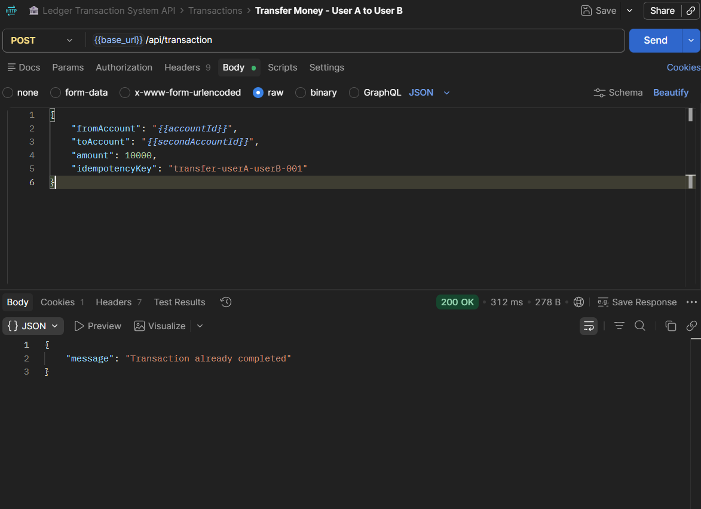
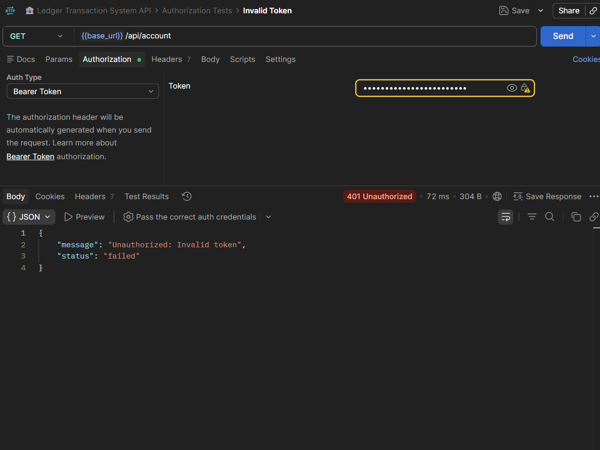

# 🏦 Ledger Transaction System

A backend banking transaction system built with Node.js, Express.js, MongoDB and JWT authentication.

## 🚀 Features

- JWT-based authentication
- Cookie-based authentication
- User registration and login
- Bank account creation
- Ledger-based balance calculation
- Account-to-account money transfers
- Double-entry ledger system
- MongoDB transactions for atomic operations
- Idempotency key support
- Token blacklisting on logout
- System-user authorization
- Immutable ledger entries
- Email notifications

## 🛠️ Tech Stack

- **Node.js** — Backend runtime
- **Express.js** — REST API framework
- **MongoDB** — Database
- **Mongoose** — MongoDB ODM
- **JWT** — Authentication
- **bcryptjs** — Password hashing
- **cookie-parser** — Cookie handling
- **Postman** — API testing

## 🏗️ Architecture

The application follows a layered backend architecture:

```text
Client / Postman
       ↓
    Express
       ↓
     Routes
       ↓
  Middleware
       ↓
  Controllers
       ↓
    Models
       ↓
    MongoDB

The transaction system follows a ledger-based approach:

User A Account
      │
      │ Debit
      ▼
  Transaction
      │
      │ Credit
      ▼
User B Account

Account balance is calculated from ledger entries:

Balance = Total Credits - Total Debits


## 📁 Project Structure

```text
ledger-transaction-system/
│
├── src/
│   ├── config/
│   ├── controller/
│   ├── middleware/
│   ├── models/
│   ├── routes/
│   ├── services/
│   └── app.js
│
├── .env.example
├── .gitignore
├── package.json
├── package-lock.json
├── server.js
└── README.md

## 🔌 API Endpoints

### Authentication

| Method | Endpoint | Description |
|---|---|---|
| POST | `/api/auth/register` | Register a new user |
| POST | `/api/auth/login` | Login user |
| POST | `/api/auth/logout` | Logout and blacklist token |

### Accounts

| Method | Endpoint | Description |
|---|---|---|
| POST | `/api/account` | Create a new account |
| GET | `/api/account` | Get logged-in user's accounts |
| GET | `/api/account/balance/:accountId` | Get account balance |

### Transactions

| Method | Endpoint | Description |
|---|---|---|
| POST | `/api/transaction` | Transfer money between accounts |
| POST | `/api/transaction/system/initial-funds` | Add initial funds using system user |


## 🔐 Authentication

The API uses JWT-based authentication to protect private routes.

After successful login, a JWT token is generated and stored in a cookie. Protected routes can also accept the token through the `Authorization` header.

Example:

```text
Authorization: Bearer <JWT_TOKEN>

Authentication Flow


Register
   ↓
Login
   ↓
JWT Token Generated
   ↓
Token Stored in Cookie
   ↓
Protected Request
   ↓
JWT Verification
   ↓
Access Granted


Logout & Token Blacklisting

When a user logs out, the JWT token is added to a blacklist and the authentication cookie is cleared.

Any future request using the blacklisted token is rejected.


## 💸 Transaction Flow

A money transfer is processed using an atomic transaction flow:

```text
1. Validate request
        ↓
2. Check idempotency key
        ↓
3. Validate account status
        ↓
4. Calculate sender balance from ledger
        ↓
5. Create transaction as PENDING
        ↓
6. Create DEBIT ledger entry
        ↓
7. Create CREDIT ledger entry
        ↓
8. Mark transaction as COMPLETED
        ↓
9. Commit MongoDB transaction
        ↓
10. Send transaction email

Each successful transfer creates two ledger entries:
    Sender Account → DEBIT
    Receiver Account → CREDIT


## 🔄 Idempotency

The transaction system uses an `idempotencyKey` to prevent duplicate financial transactions.

Each transaction request must contain a unique idempotency key:

```json
{
  "fromAccount": "ACCOUNT_A_ID",
  "toAccount": "ACCOUNT_B_ID",
  "amount": 2000,
  "idempotencyKey": "unique-transfer-key"
}

If the same request is submitted again with the same idempotencyKey, the existing transaction is detected and a duplicate transaction is not created.

Example response:
{
  "message": "Transaction already completed"
}

## 🛡️ Security

The application implements multiple security mechanisms:

- **JWT Authentication** for protected API routes
- **Password Hashing** using bcrypt
- **Token Blacklisting** after logout
- **Account Ownership Validation** to prevent users from accessing other users' accounts
- **System User Authorization** for initial-funds operations
- **Immutable Ledger Entries** to prevent modification or deletion of financial records
- **Token Expiration** for blacklisted tokens using MongoDB TTL indexing

## ⚙️ Environment Variables

Create a `.env` file in the project root and add the required environment variables.

Example:

```env
PORT=3001
MONGO_URI=your_mongodb_connection_string
JWT_SECRET=your_jwt_secret


If email functionality is configured, add the required email service variables as well.

Never commit the actual .env file to GitHub. Use .env.example as a reference.

## 💻 Installation & Setup

### 1. Clone the repository

```bash
git clone https://github.com/Kushdubey005/ledger-transaction-system.git

2. Navigate to the project

cd ledger-transaction-system

3. Install dependencies

npm install

4. Configure environment variables
Create a .env file in the project root and add your MongoDB connection string and JWT secret.

5. Start the server

node server.js

The API will run at:http://localhost:3001

6. Test the API

Open:http://localhost:3001/

Expected response:Ledger Transaction System API is running


## 🧪 API Testing

The API was tested using Postman with both successful and failure scenarios.

### Tested Scenarios

- User registration
- Duplicate registration
- User login
- Invalid login
- Account creation
- Account retrieval
- Account balance verification
- Initial funds
- Successful money transfer
- Insufficient funds
- Invalid account
- Idempotency protection
- Cross-user account access
- Missing authentication token
- Invalid JWT
- Blacklisted JWT

The testing demonstrated authentication, authorization, transaction processing, ledger-based balance calculation, and error handling.


## 📸 API Testing Screenshots

### 🔐 Authentication

Postman testing for user registration, login, and authentication errors.



### 🏦 Account Management

Account creation, account retrieval, and ledger-based balance verification.


### 💸 Transaction Processing

Initial funds, successful money transfer, insufficient funds, and idempotency testing.





### 🛡️ Security Testing

Testing unauthorized access, invalid JWT tokens, cross-user account access, and blacklisted tokens.



## 🔮 Future Improvements

- Add transaction history API
- Add account freeze and unfreeze functionality
- Add account closing functionality
- Add pagination for transactions
- Add request validation middleware
- Add automated unit and integration tests
- Add Swagger/OpenAPI documentation
- Move email notifications to background jobs
- Add Docker support
- Add CI/CD pipeline

## 👨‍💻 Author

**Kush Dubey**

GitHub:  
https://github.com/Kushdubey005
